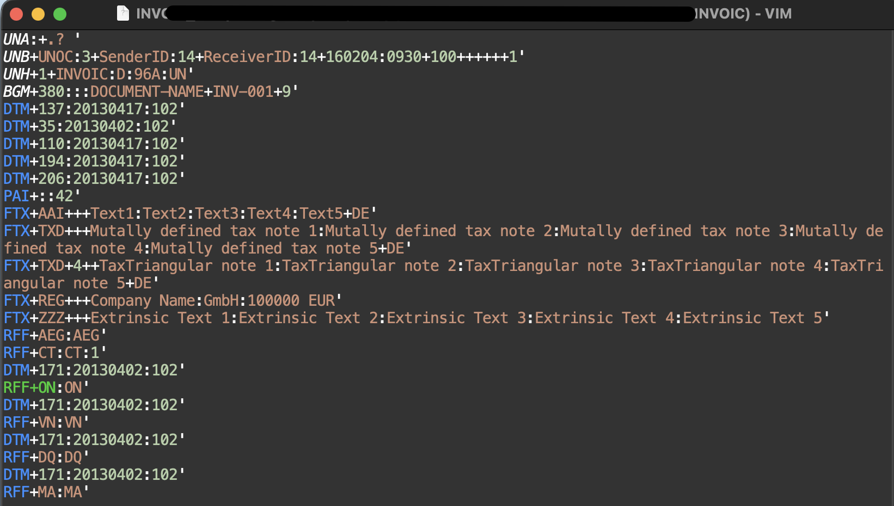
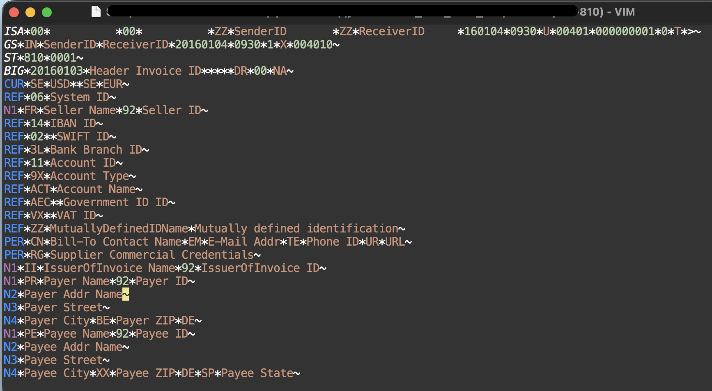

# vim-edi-cat

### Syntax Highlight for .x12 .edi .edifact file.
### This is only tested under **desert** colorscheme under MacVim.
You can also use set filetype to change syntax highlight for any text file.

```vim
set filetype=x12        " for X12
set filetype=edifact    " for edifact
```

## Install
- Don't forget to uninstall other plugin that may conflict with this plugin
for editing .x12 .edi .edifact files.
- Edit ~/.vimrc, put entry between plug#bing and plug#end
    ```
    Plug 'zc2tech/vim-edi-cat'
    ```
- Run ':PlugInstall' in VIM command mode


## Example

### Same style for X12 and EDIFACT files

#### EDIFACT:

#### X12:

